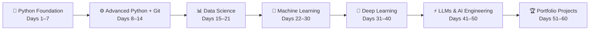

# ai-engineer-60days
 60-Day structured roadmap to become an AI Engineer — Python → Data Science → ML → Deep Learning → LLMs → RAG → Portfolio Projects | 8-10 hrs/day | Learn 20% Theory, 80% Practical
<div align="center">


<br/>

[](.)
[](.)
[](.)
[](.)

<br/>

```
╔══════════════════════════════════════════════════════════════════╗
║   🎯  GOAL: AI Intern / Fresher AI Engineer in 60 Days         ║
║   📅  Daily Commitment: 8–10 hours of focused work             ║
║   💻  Code Every Single Day — No Excuses                       ║
║   🚀  From Python Basics → Portfolio-Ready AI Engineer         ║
╚══════════════════════════════════════════════════════════════════╝
```

</div>

---
## 🗺️ Roadmap Overview


---

## 📋 The 5 Golden Rules

<div align="center">

| # | Rule | Details |
|---|------|---------|
| 1 | ⏰ **Daily 8–10 hours** | No skipping, no half-days |
| 2 | 💻 **Code every day** | Even 1 small script counts |
| 3 | 📦 **Weekly project** | Ship something every week |
| 4 | 🤖 **ChatGPT as mentor** | Ask doubts, get unstuck fast |
| 5 | 🐙 **GitHub daily push** | Your streak = your portfolio |

</div>

---

## 🐍 DAYS 1–7 — Python Foundation

> *Build your Python muscle. These basics will carry you through the entire 60 days.*

<details open>
<summary><b>📅 Day 1 — Variables, Data Types, I/O</b></summary>

**📖 Learn:**
- Variables & Data Types (`int`, `float`, `str`, `bool`)
- `input()` / `print()` — how programs talk to users

**🛠️ Practice Projects:**
- `calculator.py` — Basic arithmetic operations
- `age_calculator.py` — Calculate age from birth year
- `temp_converter.py` — Celsius ↔ Fahrenheit converter

</details>

<details>
<summary><b>📅 Day 2 — Conditionals</b></summary>

**📖 Learn:**
- `if`, `elif`, `else`
- Nested if statements

**🛠️ Practice Projects:**
- `grade_calculator.py` — A → F grading system
- `atm_simulator.py` — PIN check + balance logic

</details>

<details>
<summary><b>📅 Day 3 — Loops</b></summary>

**📖 Learn:**
- `for` loops, `while` loops
- `break`, `continue`, `range()`

**🛠️ Practice Projects:**
- `multiplication_table.py` — Print any table
- `number_guessing_game.py` — Random number + hints

</details>

<details>
<summary><b>📅 Day 4 — Functions</b></summary>

**📖 Learn:**
- `def`, parameters, return values
- Default arguments, `*args`, `**kwargs`

**🛠️ Practice Projects:**
- `calculator_functions.py` — Modular calculator using functions

</details>

<details>
<summary><b>📅 Day 5 — Lists</b></summary>

**📖 Learn:**
- List creation, indexing, slicing
- List methods: `append`, `remove`, `sort`, `pop`

**🛠️ Practice Projects:**
- `student_management.py` — Add/view/delete students

</details>

<details>
<summary><b>📅 Day 6 — Dictionaries</b></summary>

**📖 Learn:**
- Key-value pairs, nested dicts
- Dict methods: `get`, `items`, `keys`, `values`

**🛠️ Practice Projects:**
- `contact_book.py` — Save and search contacts

</details>

<details>
<summary><b>📅 Day 7 — 🏆 PROJECT: CLI Personal Expense Tracker</b></summary>

**✅ Build:**

```
📁 expense-tracker/
├── expense_tracker.py   # Main app
├── data.json            # Storage
└── README.md            # Project description
```

**Features:** Add expense → View by category → Monthly total → Save to file

</details>

---

## ⚙️ DAYS 8–14 — Python Advanced + Git

> *Level up Python. Learn Git. Start pushing your work to the world.*

<details open>
<summary><b>📅 Day 8 — OOP: Classes & Objects</b></summary>

**📖 Learn:**
- `class`, `__init__`, `self`
- Methods, attributes, inheritance

**🛠️ Practice:**
- `student_class.py` — Student object with name, grade, GPA

</details>

<details>
<summary><b>📅 Day 9 — File Handling</b></summary>

**📖 Learn:**
- `open()`, `read()`, `write()`, `with` statement
- Working with `.txt` and `.json`

**🛠️ Practice:**
- `notes_app.py` — Create/read/delete notes saved to files

</details>

<details>
<summary><b>📅 Day 10 — Exception Handling</b></summary>

**📖 Learn:**
- `try`, `except`, `finally`
- Custom exceptions

**🛠️ Practice:**
- `robust_calculator.py` — Handle divide-by-zero, invalid input

</details>

<details>
<summary><b>📅 Day 11 — Git & GitHub</b></summary>

**📖 Learn:**
- `git init`, `add`, `commit`, `push`, `pull`
- Branching and merging basics

**🛠️ Practice:**
- Push ALL projects built so far to GitHub
- Write README.md for each project

</details>

<details>
<summary><b>📅 Day 12 — APIs</b></summary>

**📖 Learn:**
- What is a REST API?
- `requests` library, HTTP GET

**🛠️ Practice:**
- `weather_app.py` — Fetch live weather using OpenWeatherMap API

</details>

<details>
<summary><b>📅 Day 13 — JSON</b></summary>

**📖 Learn:**
- `json.loads()`, `json.dumps()`
- Parsing nested API responses

**🛠️ Practice:**
- `api_parser.py` — Extract and display data from JSON response

</details>

<details>
<summary><b>📅 Day 14 — 🏆 PROJECT: Weather Dashboard</b></summary>

**✅ Build:**

```
📁 weather-dashboard/
├── app.py            # Main app
├── api_handler.py    # API calls
├── display.py        # Pretty output
└── README.md
```

**Features:** City search → Temperature + Humidity + Wind → 5-day forecast

</details>

---

## 📊 DAYS 15–21 — Data Science

> *Learn to speak the language of data. Every AI project starts with data.*

<details open>
<summary><b>📅 Day 15 — NumPy</b></summary>

**📖 Learn:** Arrays, vectorized operations, broadcasting

**🛠️ Practice:** Array manipulations, math operations

</details>

<details>
<summary><b>📅 Day 16 — Pandas</b></summary>

**📖 Learn:** DataFrames, reading CSVs, filtering, groupby

**🛠️ Practice:** Analyze a real CSV dataset

</details>

<details>
<summary><b>📅 Day 17 — Data Cleaning</b></summary>

**📖 Learn:** Handling nulls, duplicates, outliers, type conversion

**🛠️ Practice:** Clean a messy real-world dataset

</details>

<details>
<summary><b>📅 Day 18 — Matplotlib</b></summary>

**📖 Learn:** Line, bar, scatter, histogram, subplots

**🛠️ Practice:** Visualize data with 5+ different chart types

</details>

<details>
<summary><b>📅 Day 19 — Seaborn</b></summary>

**📖 Learn:** Heatmaps, pairplots, violin plots, correlation

**🛠️ Practice:** Advanced visualizations on a dataset

</details>

<details>
<summary><b>📅 Day 20 — 🏆 MINI PROJECT: Sales Data Analysis</b></summary>

**✅ Build:** Full EDA notebook on real sales data
- Load → Clean → Analyze → Visualize → Insights

</details>

<details>
<summary><b>📅 Day 21 — GitHub Upload Day</b></summary>

- Clean up all notebooks
- Add proper README to each project
- Push everything to GitHub
- Update your profile README

</details>

---

## 🤖 DAYS 22–30 — Machine Learning

> *Teach computers to learn from data. This is where AI begins.*

<details open>
<summary><b>📅 Day 22 — ML Fundamentals</b></summary>

**📖 Learn:**
- What is Machine Learning?
- Supervised vs Unsupervised
- The ML Workflow: Data → Model → Evaluate → Deploy

</details>

<details>
<summary><b>📅 Day 23 — Linear Regression</b></summary>

**📖 Learn:** How linear regression works, cost function, gradient descent

**🛠️ Practice:** `house_price_prediction.py` using scikit-learn

</details>

<details>
<summary><b>📅 Day 24 — Logistic Regression</b></summary>

**📖 Learn:** Binary classification, sigmoid function, threshold

**🛠️ Practice:** `customer_churn_prediction.py`

</details>

<details>
<summary><b>📅 Day 25 — Train/Test Split & Cross Validation</b></summary>

**📖 Learn:** Why split data, `train_test_split`, k-fold CV, overfitting

</details>

<details>
<summary><b>📅 Day 26 — Evaluation Metrics</b></summary>

**📖 Learn:** Accuracy, Precision, Recall, F1-Score, ROC-AUC, Confusion Matrix

</details>

<details>
<summary><b>📅 Day 27 — Decision Trees</b></summary>

**📖 Learn:** How trees split data, Gini impurity, max depth

</details>

<details>
<summary><b>📅 Day 28 — Random Forest</b></summary>

**📖 Learn:** Ensemble learning, bagging, feature importance

</details>

<details>
<summary><b>📅 Day 29 — 🏆 MINI PROJECT: Employee Salary Predictor</b></summary>

**✅ Build:**
```
📁 salary-predictor/
├── data/           # Dataset
├── model.py        # Training code
├── predict.py      # Inference
├── notebook.ipynb  # EDA + Training
└── README.md
```

</details>

<details>
<summary><b>📅 Day 30 — Revision Day</b></summary>

- Revisit all ML concepts
- Improve existing projects
- Read about upcoming: Neural Networks

</details>

---

## 🧠 DAYS 31–40 — Deep Learning

> *The technology behind ChatGPT, image recognition, and self-driving cars.*

<details open>
<summary><b>📅 Days 31–32 — Neural Networks</b></summary>

**📖 Learn:**
- Perceptron, layers, activation functions
- Backpropagation, weights, bias
- Understand the math intuitively

</details>

<details>
<summary><b>📅 Days 33–34 — TensorFlow / Keras</b></summary>

**📖 Learn:**
- `Sequential` model, `Dense` layers
- `compile()`, `fit()`, `evaluate()`
- Callbacks: `ModelCheckpoint`, `EarlyStopping`

</details>

<details>
<summary><b>📅 Days 35–36 — CNNs (Convolutional Neural Networks)</b></summary>

**📖 Learn:**
- Conv2D, MaxPooling, Flatten
- How CNNs see images (filters, feature maps)
- Transfer learning basics

</details>

<details>
<summary><b>📅 Days 37–38 — Image Classification Practice</b></summary>

**🛠️ Practice:**
- Train on CIFAR-10 or custom dataset
- Data augmentation
- Evaluate with confusion matrix

</details>

<details>
<summary><b>📅 Days 39–40 — 🏆 PROJECT: Handwritten Digit Recognition</b></summary>

**✅ Build:**
```
📁 digit-recognition/
├── model/              # Saved model
├── train.py            # Training script
├── predict.py          # Single image prediction
├── app.py              # Streamlit/Gradio UI
└── README.md
```

**Tech:** TensorFlow + Keras + MNIST + Streamlit

</details>

---

## ⚡ DAYS 41–50 — LLMs & AI Engineering

> *This is the most important section. This is what companies are hiring for RIGHT NOW.*

<details open>
<summary><b>📅 Day 41 — What are LLMs?</b></summary>

**📖 Learn:**
- How Large Language Models work (high level)
- GPT, Claude, Gemini — similarities and differences
- Tokens, context windows, temperature

</details>

<details>
<summary><b>📅 Day 42 — Transformers Architecture</b></summary>

**📖 Learn:**
- Attention mechanism ("Attention is All You Need")
- Encoder-Decoder, self-attention
- Why transformers changed everything

</details>

<details>
<summary><b>📅 Day 43 — Prompt Engineering</b></summary>

**📖 Learn:**
- Zero-shot, few-shot, chain-of-thought prompting
- System prompts, role assignment
- Prompt patterns and templates

**🛠️ Practice:**
- Write 50 different prompts across categories
- Document what works and what doesn't

</details>

<details>
<summary><b>📅 Day 44 — OpenAI API</b></summary>

**📖 Learn:**
- `openai.ChatCompletion.create()`
- System/User/Assistant roles
- Streaming responses

**🛠️ Practice:**
- `chatbot.py` — A conversational chatbot with memory

</details>

<details>
<summary><b>📅 Day 45 — LangChain</b></summary>

**📖 Learn:**
- Chains, prompts, output parsers
- LLM wrappers, `ConversationChain`
- Why LangChain exists

</details>

<details>
<summary><b>📅 Day 46 — Embeddings</b></summary>

**📖 Learn:**
- What are vector embeddings?
- Semantic similarity, cosine distance
- `text-embedding-ada-002`

</details>

<details>
<summary><b>📅 Day 47 — Vector Databases</b></summary>

**📖 Learn:**
- ChromaDB, Pinecone, Weaviate
- Storing and querying embeddings
- Similarity search

</details>

<details>
<summary><b>📅 Day 48 — RAG (Retrieval Augmented Generation)</b></summary>

**📖 Learn:**
- Why RAG > fine-tuning for most use cases
- Document loading → Chunking → Embedding → Retrieval → Generation
- LangChain RAG pipeline

</details>

<details>
<summary><b>📅 Days 49–50 — 🏆 PROJECT: PDF Chatbot</b></summary>

**✅ Build:**
```
📁 pdf-chatbot/
├── app.py              # Streamlit UI
├── loader.py           # PDF text extraction
├── embedder.py         # Create & store embeddings
├── retriever.py        # Query vector DB
├── chain.py            # LangChain RAG chain
└── README.md
```

**Tech:** LangChain + ChromaDB + OpenAI + Streamlit

</details>

---

## 🏆 DAYS 51–60 — Portfolio-Level Projects

> *Three projects that will get you interviews. Build them like a professional product.*

### 📁 Project 1: Resume Analyzer `[Days 51–53]`

```
📁 resume-analyzer/
├── app.py                  # Streamlit UI
├── parser.py               # Extract text from PDF
├── analyzer.py             # LLM-powered analysis
├── scorer.py               # ATS score calculation
├── improver.py             # Suggest improvements
├── sample_resumes/         # Test data
└── README.md
```

**Features:**
- Upload any resume (PDF)
- Get ATS compatibility score
- Get role-specific improvement suggestions
- Extract skills, experience, keywords automatically

**Tech:** LangChain + OpenAI + PyPDF2 + Streamlit

---

### 📁 Project 2: AI Interview Assistant `[Days 54–56]`

```
📁 ai-interview-assistant/
├── app.py                  # Main UI
├── question_gen.py         # Generate role-based questions
├── evaluator.py            # Evaluate answers
├── feedback.py             # Detailed feedback engine
├── roles/                  # Role configs
└── README.md
```

**Features:**
- Select job role (Frontend / Backend / Data Scientist / AI)
- AI generates domain-specific interview questions
- Submit answers → Get scored feedback
- Track performance across sessions

**Tech:** OpenAI API + LangChain + Streamlit

---

### 📁 Project 3: AI Content Generator `[Days 57–59]`

```
📁 ai-content-generator/
├── app.py                  # Main UI
├── generators/
│   ├── blog.py             # Blog post generator
│   ├── social.py           # LinkedIn/Twitter posts
│   ├── email.py            # Email campaigns
│   └── caption.py          # Image captions
├── templates/              # Prompt templates
└── README.md
```

**Features:**
- Multi-format content (Blog / LinkedIn / Twitter / Email)
- Tone selector (Professional / Casual / Humorous)
- One-click regenerate
- Export to `.docx` / `.txt`

**Tech:** LangChain + OpenAI + Streamlit

---

### 📅 Day 60 — Portfolio Setup

<div align="center">

```
🎯  YOUR FINAL GITHUB PORTFOLIO
━━━━━━━━━━━━━━━━━━━━━━━━━━━━━━━━━━━━━━━━━━━━━━━━━
  1. 💰  expense-tracker          → Python CLI
  2. 🌤️  weather-dashboard        → APIs + Data
  3. 📊  sales-data-analysis      → Data Science
  4. 💼  salary-predictor         → Machine Learning
  5. ✍️  digit-recognition        → Deep Learning
  6. 📄  pdf-chatbot              → RAG + LLMs
  7. 📋  resume-analyzer          → AI Product
  8. 🎤  ai-interview-assistant   → AI Product
  9. ✍️  ai-content-generator     → AI Product
━━━━━━━━━━━━━━━━━━━━━━━━━━━━━━━━━━━━━━━━━━━━━━━━━
```

</div>

---

## 🛠️ Tech Stack

<div align="center">

| Layer | Technologies |
|-------|-------------|
| **Language** |  |
| **Data** |    |
| **ML/DL** |   |
| **LLMs** |   |
| **Vector DB** |   |
| **UI** |  |
| **DevOps** |   |

</div>

---

## 📈 Progress Tracker

> Update this as you go!

| Phase | Days | Status | Project |
|-------|------|--------|---------|
| 🐍 Python Foundation | 1–7 | ⬜ Not Started | Expense Tracker |
| ⚙️ Python Advanced | 8–14 | ⬜ Not Started | Weather Dashboard |
| 📊 Data Science | 15–21 | ⬜ Not Started | Sales Analysis |
| 🤖 Machine Learning | 22–30 | ⬜ Not Started | Salary Predictor |
| 🧠 Deep Learning | 31–40 | ⬜ Not Started | Digit Recognition |
| ⚡ LLMs & AI Eng | 41–50 | ⬜ Not Started | PDF Chatbot |
| 🏆 Portfolio Projects | 51–60 | ⬜ Not Started | 3 AI Products |

---

## 💡 Pro Tips

```python
pro_tips = {
    "start_smart": "Python basics already unte Days 1-14 ni 5-6 days lo complete cheyyi",
    "focus_here":  "Max time LLMs + RAG + LangChain + Projects meeda pett",
    "hiring_2026": "Companies want PROJECT EXPERIENCE, not certificates",
    "use_ai":      "ChatGPT ni mentor laga use cheyyi — doubts, code reviews, explanations",
    "git_daily":   "Every day oka commit — even learning notes count",
    "document":    "Every project ki proper README raayu — this is your portfolio",
}
```

---

## 🚀 After 60 Days, You Can Apply For

- 🤖 AI Engineer (Fresher)
- 🔬 ML Engineer Intern
- 📊 Data Analyst / Data Science Intern
- 🧪 Prompt Engineer
- 🏗️ LLM Application Developer

---

<div align="center">

```
"Ee roadmap ni serious ga follow ayithe
 60 days tarvata AI Intern/Fresher AI Engineer
 interviews attempt cheyyagalige level ki vellachu."
```

<br/>

**⭐ Star this repo if it helped you | 🍴 Fork to start your own journey**


</div>
